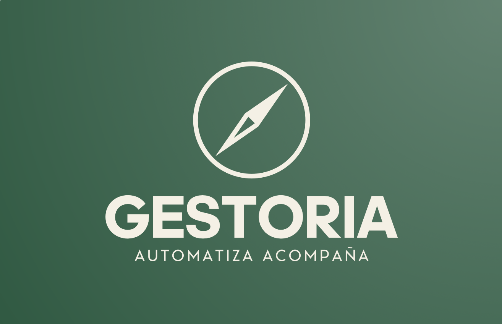

# GestorIA

## La gestion de tu asesoria, clara desde el primer minuto

GestorIA es una aplicacion de escritorio pensada para asesorias que quieren dejar atras hojas de calculo, documentos sueltos y procesos repetidos a mano. Reune en un unico lugar el control horario, clientes, trabajos, facturacion, pagos, deuda viva, auditoria y cierre mensual.

<p align="center">
  
</p>

GestorIA no es solo una intranet: es una mesa de control para saber que ocurre en la asesoria, que esta pendiente, quien esta trabajando en cada tarea y que importes siguen sin cobrarse.

<p align="center">
  
</p>

---

## Que hace diferente a GestorIA

### Todo el negocio en una sola pantalla operativa

Desde el panel principal puedes consultar horas fichadas, clientes activos, trabajos abiertos, facturacion, cobros y deuda pendiente. La informacion importante aparece resumida, visual y lista para tomar decisiones.

### Control horario preparado para el dia a dia

Los empleados pueden registrar entradas, salidas y pausas. El gerente puede revisar fichajes, corregir incidencias y exportar informes mensuales en CSV o PDF.

### Clientes y trabajos conectados

Cada cliente puede tener sus trabajos, comentarios, responsables, estados y prioridades. El tablero Kanban permite ver rapidamente que esta pendiente, en curso, bloqueado o finalizado.

### Facturacion y pagos sin perder trazabilidad

GestorIA permite registrar facturas, pagos parciales o completos, vencimientos y deuda viva por cliente. El sistema calcula estados y pendientes para que la gestion economica sea mas clara.

### Auditoria para trabajar con confianza

Las acciones criticas quedan registradas: cambios en empleados, clientes, trabajos, facturas, pagos y fichajes. Esto aporta trazabilidad y facilita revisar que ha ocurrido en cada momento.

### Experiencia de escritorio

La aplicacion se abre como una app nativa con `GestorIA.app`, muestra una pantalla de carga con progreso y arranca la pila necesaria para trabajar en local.

---

## Modulos incluidos

| Modulo | Que aporta |
|---|---|
| Inicio | KPIs, resumen operativo, actividad y graficas. |
| Fichaje | Entrada, salida, pausas, correcciones y exportaciones. |
| Clientes | Alta, edicion, busqueda, detalle y control fiscal. |
| Trabajos | Kanban, asignaciones, prioridades, estados y comentarios. |
| Pagos | Facturas, cobros, deuda viva, vencidos y pagos recientes. |
| Administracion | Empleados, fichajes globales, auditoria y cierre mensual. |
| IA | Widget de apoyo para consultas de ambito legal/operativo. |

---

## Pensada para asesorias pequenas

GestorIA esta disenada para equipos que necesitan una herramienta practica, visual y local:

- datos centralizados,
- menos duplicidad,
- menos errores manuales,
- control de jornada,
- seguimiento de trabajos,
- visibilidad economica,
- exportaciones listas para revisar,
- base preparada para automatizacion documental.

---

## Arranque rapido

### Requisitos

- Docker Desktop instalado y en ejecucion.
- Node.js disponible.
- Dependencias instaladas en `app/` con `npm install`.

### Abrir como aplicacion macOS

```bash
chmod +x GestorIA.app/Contents/MacOS/GestorIA
xattr -cr GestorIA.app
```

Despues, abre `GestorIA.app` con doble clic.

### Levantar la pila por terminal

```bash
docker-compose up --build
```

### Lanzador alternativo

```bash
bash scripts/launch.sh
```

---

## Documentacion tecnica

Para profundizar en arquitectura, backend, frontend, modelo de datos y flujo de desarrollo:

- [`MEMORIA.md`](MEMORIA.md)
- [`app/README.md`](app/README.md)
- [`backend/README.md`](backend/README.md)
- [`docs/DESARROLLO.md`](docs/DESARROLLO.md)
- [`docs/PLAN_SPRINTS.md`](docs/PLAN_SPRINTS.md)
- [`docs/modelo_datos.md`](docs/modelo_datos.md)

